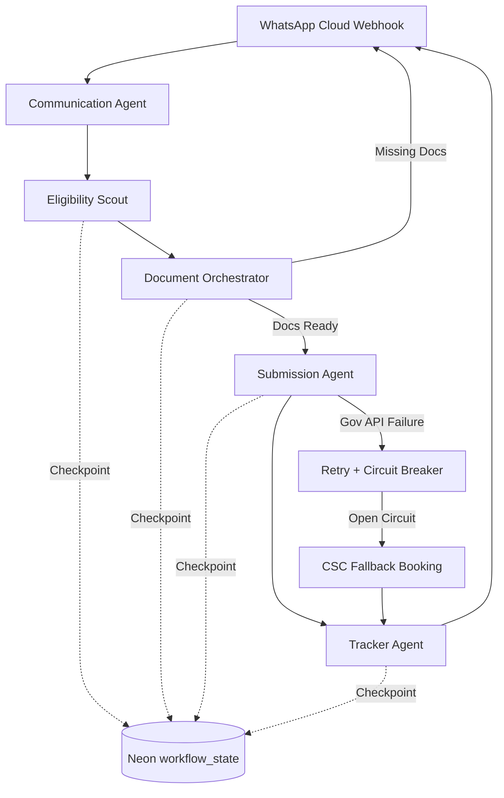

# Saarthi Core MVP - Phase 0

Saarthi AI is a WhatsApp-first 5-agent pipeline for Indian citizens.

## Vision Prompt

Saarthi AI is a WhatsApp-first 5-agent pipeline for Indian citizens. User says in Hindi/Marathi: मेरी पत्नी ने पिछले महीने बच्चे को जन्म दिया।
1. Eligibility Scout returns PM Matru Vandana + others.
2. Document Orchestrator drives DigiLocker OAuth consent and document pull.
3. Submission Agent submits to portal or books CSC fallback.
4. Tracker Agent runs weekly updates and grievance escalation.
5. Communication Agent sends all responses in user language via Sarvam.
Orchestration uses LangGraph with Neon Postgres checkpointing so workflow never loses state across days.

## Architecture

## Bootstrap

1. Copy `.env.example` to `.env`.
2. Run `supabase/schema.sql` in Neon SQL editor.
3. Install deps with `npm install`.
4. Run dev server with `npm run dev`.

## Current Status

- Project scaffold complete.
- Integrations and graph wiring include production-safe interfaces and stubs.
- Next implementation target: full DigiLocker OAuth and live webhook roundtrip.
